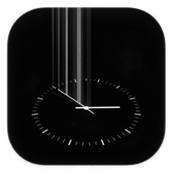

# Live Clock Wallpaper (Minimalist AMOLED)

A sleek, minimalist Android Live Wallpaper featuring a 3D perspective clock face with real-time continuous hand movement and dynamic vertical light strands extending upward from the second hand. Optimized for AMOLED displays with pure black backgrounds (`#000000`) and low battery consumption.



---

## ✨ Features

- **Real-Time Analog Engine**: Calculates hour, minute, and second hand angles dynamically from device system time.
- **Continuous Smooth Motion**: Hours, minutes, and seconds sweep smoothly without abrupt ticking jumps.
- **3D Perspective Clock Disc**: Tilted horizontal ellipse clock face with 60 perimeter ticks (12 hour ticks + 48 minute ticks).
- **Signature Vertical Light Strands**: 4 razor-thin, evenly spaced vertical gradient light strands extending straight UP from the second hand.
- **Pure AMOLED Black (`#000000`)**: Designed specifically for AMOLED/OLED screens to save battery by keeping most pixels powered off.
- **Battery-Optimized Lifecycle**: Automatically pauses animation loop when the wallpaper is hidden or the screen is off (0% CPU/GPU usage when obscured).
- **Jetpack Compose Interactive Preview**: Built-in launcher app to preview the clock in real-time before applying.
- **Wide Android Compatibility**: Supports **Android 5.0 (API Level 21) through Android 15+ (API Level 35+)**.

---

## 🚀 Installation & Pre-built APK

You can download and install the pre-built signed release APK directly from this repository:

📥 **[Download Release APK](app/release/app-release.apk)** (`app/release/app-release.apk`)

---

## 📱 How to Apply to Lock Screen & Home Screen

1. Install and open the **Live Clock Wallpaper** app on your phone.
2. Tap the **Set Live Wallpaper** button.
3. In the system preview dialog that appears:
   - Select **"Lock screen and home screen"** (or **"Apply to Both"**) to display the clock on your Lock Screen!

---

## 🛠️ Building from Source

### Prerequisites
- Android Studio Ladybug (or newer) / IntelliJ IDEA
- JDK 11 or higher
- Android SDK (API Level 35)

### Build Commands
Clone the repository and build the project using Gradle:

```bash
git clone https://github.com/Commit-Craft/live-clock-wallpaper.git
cd live-clock-wallpaper

# Build Debug APK
./gradlew assembleDebug

# Build Signed Release APK
./gradlew assembleRelease
```

The output APKs will be generated in `app/build/outputs/apk/`.

---

## 📂 Project Structure

```
ClockLiveWallpaper/
├── app/
│   ├── src/main/
│   │   ├── java/com/example/clocklivewallpaper/
│   │   │   ├── MainActivity.kt                  # Compose UI & Live Wallpaper Launcher
│   │   │   └── MinimalistClockWallpaperService.kt # Core Canvas Wallpaper Engine
│   │   ├── res/                                 # Launcher icons, string resources & XML
│   │   └── AndroidManifest.xml                  # WallpaperService & Permissions
│   └── build.gradle.kts                         # App module dependencies & SDK config
├── build.gradle.kts
└── settings.gradle.kts
```

---

## 📄 License

```
MIT License

Copyright (c) 2026 Commit-Craft

Permission is hereby granted, free of charge, to any person obtaining a copy
of this software and associated documentation files (the "Software"), to deal
in the Software without restriction, including without limitation the rights
to use, copy, modify, merge, publish, distribute, sublicense, and/or sell
copies of the Software, and to permit persons to whom the Software is
furnished to do so, subject to the following conditions:

The above copyright notice and this permission notice shall be included in all
copies or substantial portions of the Software.
```
